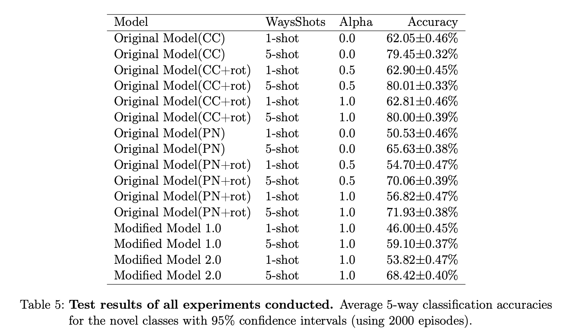

# few-shot-learning-cv

DATS-SHU 420 Data Science Senior Project | Spring 2022 | Undergrad Capstone

Yumeng Zhang, Mengjie Shen, Yuhan Yao

## Code

- `BF3S` is the original code base for the Boosting paper, which only has code for cosine classifier [1]

- `BF3S_proto` has been adapted to run ProtoNet

- `BF3S_modified_model_1.0_2nets` is the code for Modified Model 1.0

- `BF3S_modified_model_2.0_2nets` is the code for Modified Model 2.0

- `protoNet` is the code for a reproduced prototypical network [2]

## Experimental Results

## Final Presentation

## Citation

[1] [https://github.com/valeoai/BF3S](https://github.com/valeoai/BF3S)

[2] [https://github.com/oscarknagg/few-shot](https://github.com/oscarknagg/few-shot)
